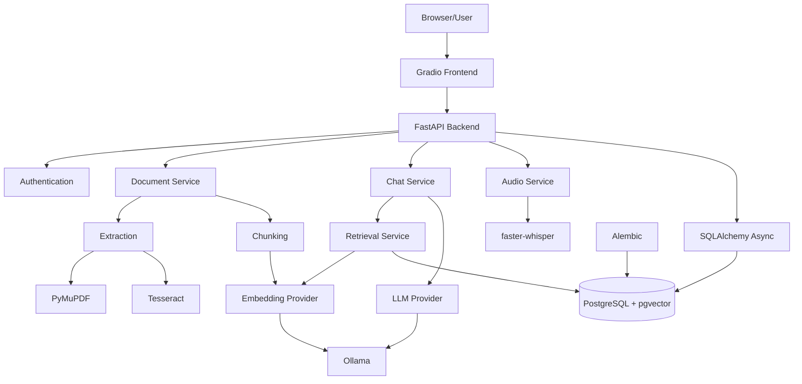

# 🏗️ System Architecture

## 1. Architectural Goal

RAG Document Assistant is split into a user interface, API/service layer, relational + vector persistence layer, and local AI providers.

The architecture keeps the **AI models replaceable** while treating ingestion, retrieval, authentication, persistence, and document lifecycle as normal application responsibilities.

## 2. Runtime Components



## 3. Service Boundaries

### Gradio

Responsible for:

- authentication UX
- chat
- document selection
- upload controls
- document preview
- voice capture
- conversation list

### FastAPI

Responsible for:

- typed REST contracts
- authentication and ownership
- ingestion orchestration
- retrieval
- chat generation
- transcription requests
- health/readiness
- persistence

### PostgreSQL + pgvector

Stores both relational and vector state:

- users
- documents
- chunks
- embeddings
- conversations
- messages
- audit-oriented metadata

### Ollama

Provides the normal local AI path:

- `nomic-embed-text` for embeddings
- `llama3.2` for answer generation

## 4. Docker Topology

```text
Host
├── Ollama :11434
└── Docker Compose
    ├── frontend :7860
    ├── backend  :8000
    └── postgres :5432
```

The backend cannot use `localhost:11434` for host Ollama because `localhost` inside a container refers to the container itself.

Compose therefore uses:

```text
http://host.docker.internal:11434
```

## 5. Persistence

Named Docker volumes keep state independently of containers:

| Volume | Data |
|---|---|
| `postgres_data` | relational records + embeddings |
| `uploads` | original user documents |
| `hf_cache` | faster-whisper/Hugging Face model cache |

## 6. Schema Evolution

Alembic migrations cover the evolution of:

- the initial relational schema
- pgvector embeddings
- provider/storage cleanup
- login fields
- context and failure metadata
- the HNSW vector index

This makes vector-search infrastructure part of normal database migration history rather than a manual setup step.

## 7. Security Boundary

Authentication is enforced server-side.

The backend derives ownership from the authenticated token and scopes document/retrieval operations by user. A browser-supplied user ID is not trusted as the source of ownership.

Passwords are stored as PBKDF2-SHA256 hashes with random salts, and access tokens are HMAC signed with an expiration timestamp.
