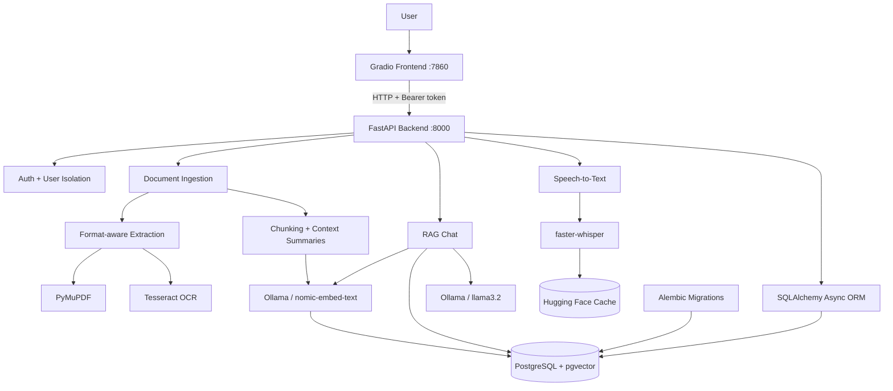
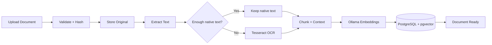
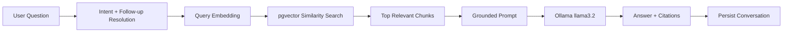

<div align="center">

# 🧠 RAG Document Assistant

### Local-first document intelligence with RAG, OCR, speech-to-text, vector search, and private LLM inference.

Upload documents, extract native or scanned content, build semantic vectors, ask grounded questions, continue multi-turn conversations, use voice queries, and receive traceable answers — all through a Dockerized FastAPI + Gradio application.

<p>
  
  
  
  
  
  
</p>

</div>

## 🎥 Demo

[▶ Watch the RAG Document Assistant demo](https://github.com/user-attachments/assets/1405cbca-9955-4bce-a0ab-7c2c6cd94b9d)

## ✨ What Makes It More Than a Basic RAG Demo

| Capability | Implementation |
|---|---|
| Document ingestion | PDF, DOCX, TXT, Markdown, CSV, HTML, JSON |
| OCR | PyMuPDF native extraction + selective Tesseract fallback |
| Chunking | Page-aware chunks + physical overlap + rolling context summaries |
| Retrieval | Ollama embeddings + PostgreSQL/pgvector + HNSW cosine search |
| Generation | Local Ollama `llama3.2` + grounded prompts + source citations |
| Voice | Local `faster-whisper` speech-to-text |
| Conversations | Persistent memory + follow-up resolution + SSE streaming |
| Security | PBKDF2-SHA256 + bearer tokens + user-scoped retrieval |
| Infrastructure | Async FastAPI + Gradio + PostgreSQL + Docker + Alembic |

The result is a private, multi-user document workspace where ingestion, retrieval, generation, OCR, audio, authentication, persistence, and deployment work together in one system.

## 🏗️ System Architecture



### Dockerized services

| Service | Purpose | Port |
|---|---|---:|
| `postgres` | PostgreSQL + pgvector | `5432` |
| `backend` | FastAPI application | `8000` |
| `frontend` | Gradio interface | `7860` |
| Ollama | Local models on the host | `11434` |

Docker volumes persist PostgreSQL data, uploaded documents, and downloaded faster-whisper/Hugging Face model files.

## 🤖 End-to-End AI Pipeline



### 1. Format-aware ingestion & selective OCR

Supported formats are `PDF`, `DOCX`, `TXT`, `Markdown`, `CSV`, `HTML`, and `JSON`.

PDFs first use **PyMuPDF native extraction**. A page falls back to **Tesseract OCR only when its extracted text is below a configured threshold**, avoiding the cost of OCR on normal text PDFs while supporting scanned and mixed documents. Page metadata records the extraction source, and a Tesseract CLI fallback is available when needed.

### 2. Context-aware chunking

The chunker combines two complementary ideas:

- **Physical overlap** keeps real boundary text across adjacent chunks so information is less likely to disappear at a split.
- **Rolling context summaries** give later chunks semantic continuity without duplicating the full document history.

```text
Document → page-aware extraction
          ↓
Chunk 0 → overlap → Chunk 1 + prior summary
                       ↓
                   Chunk 2 + prior summary
                       ↓
                  semantic embedding
```

### 3. Embeddings + vector database

```text
nomic-embed-text
      ↓
768-dimensional embedding
      ↓
PostgreSQL + pgvector
      ↓
HNSW cosine-distance index
```

Each searchable chunk retains extracted text, page/chunk metadata, chunk hash, rolling context summary, embedding, and document ownership. Keeping vectors and relational data in PostgreSQL allows retrieval to combine semantic similarity with application filters such as authenticated user ownership, selected documents, processing status, top-k limits, and relevance thresholds. HNSW provides approximate nearest-neighbour search as the corpus grows.

### 4. Retrieval-Augmented Generation



Uploaded files are **not used to retrain the LLM**. At query time, the system embeds the question, retrieves relevant chunks, and injects them into a grounded prompt. The prompt instructs the model not to invent document facts when evidence is insufficient. The focus is therefore retrieval quality, context construction, grounding, and traceability.

## 🎙️ Multimodal Voice Queries

Voice input is processed locally with **faster-whisper**:

```text
Voice → STT → text query → embedding → retrieval → LLM → cited answer
```

The STT pipeline supports microphone/audio uploads, CPU execution, `int8` compute, optional language selection, configurable beam search, VAD, audio validation/size limits, and persistent Hugging Face model caching. Transcribed text is placed into the composer for review before retrieval.

## 🔐 Authentication & Multi-User Isolation

The application uses a user-scoped document workspace rather than a global document pool. It includes:

- Account registration and login
- PBKDF2-SHA256 password hashing with random salts
- Signed bearer access tokens and expiration
- Authenticated document and conversation ownership
- User-scoped vector retrieval
- Per-user duplicate checks

The authenticated user is applied as a retrieval constraint before document chunks are returned, preventing one user's documents from entering another user's search results.

## 💬 Conversation Intelligence

The chat layer supports more than one-shot Q&A:

- **Multi-turn memory:** recent conversation messages are persisted and loaded for follow-up questions.
- **Follow-up resolution:** references such as “Explain the third point” can be rewritten using previous assistant context before retrieval.
- **Intent routing:** simple greetings, thanks, farewells, and calculation-like messages can bypass unnecessary retrieval work.
- **Streaming:** chat responses can be delivered progressively through Server-Sent Events (SSE).
- **Source awareness:** retrieved chunks retain filename, page, chunk index, score, and excerpts so answers can be traced back to source material.

## 🧠 Local AI

| AI task | Default model |
|---|---|
| Embeddings | `nomic-embed-text` |
| Answer generation | `llama3.2` |
| Speech transcription | `faster-whisper` |

Ollama handles embeddings and generation locally. The Dockerized backend reaches host Ollama through `host.docker.internal:11434`. Configuration exposes controls for model keep-alive, warmup, context window, maximum predicted tokens, timeouts, retrieved-context caps, summary caps, and relevance thresholds — useful when running local models on constrained hardware.

The provider abstraction also supports OpenAI for embeddings and/or generation, while the primary setup remains local Ollama.

## 🧰 Technology Stack

| Layer | Technology | Role |
|---|---|---|
| Language | **Python 3.12** | Core application and AI pipeline |
| Frontend | **Gradio** | Chat UI, uploads, document controls, voice input |
| API | **FastAPI** | Typed async REST API + OpenAPI |
| ORM | **SQLAlchemy Async** | Async persistence and model mapping |
| Migrations | **Alembic** | Versioned schema evolution |
| Database | **PostgreSQL** | Users, documents, chunks, conversations, messages |
| Vector search | **pgvector + HNSW** | Semantic storage and approximate nearest-neighbour retrieval |
| LLM | **Ollama + llama3.2** | Local grounded generation |
| Embeddings | **Ollama + nomic-embed-text** | 768-dimensional semantic vectors |
| OCR | **Tesseract + PyMuPDF** | Selective scanned-PDF extraction |
| STT | **faster-whisper** | Local voice transcription |
| Extraction | **python-docx, pandas, BeautifulSoup** | DOCX, CSV, HTML and text-oriented formats |
| HTTP | **httpx** | Async service/provider communication |
| Containers | **Docker + Docker Compose** | Reproducible multi-service environment |
| Testing | **pytest / pytest-asyncio** | Unit, integration, security and E2E tests |
| Quality | **Ruff + mypy** | Linting, formatting and type checking |
| CI | **GitHub Actions** | Automated repository checks and secret scanning |

## 🚀 Getting Started

### Prerequisites

Install **Docker Desktop with Docker Compose**, **Ollama**, and Git. The backend image installs Tesseract automatically.

### 1. Clone and configure

```bash
git clone <YOUR_REPOSITORY_URL>
cd RAG-Document-Assistant
cp .env.example .env
```

On Windows Command Prompt:

```bat
copy .env.example .env
```

Set at minimum:

```env
AUTH_SECRET_KEY=replace_with_a_long_random_secret
POSTGRES_PASSWORD=replace_with_a_database_password
```

Generate a strong application secret with `openssl rand -hex 32`. Never commit the real `.env` file.

### 2. Pull local models

```bash
ollama pull llama3.2
ollama pull nomic-embed-text
ollama list
```

### 3. Build and start

```bash
docker compose up --build -d
docker compose ps
```

### 4. Open the application

| Service | URL |
|---|---|
| Gradio UI | `http://127.0.0.1:7860` |
| FastAPI docs | `http://127.0.0.1:8000/docs` |
| API health | `http://127.0.0.1:8000/api/v1/health` |
| API readiness | `http://127.0.0.1:8000/api/v1/ready` |

Stop the stack with:

```bash
docker compose down
```

> Avoid `docker compose down -v` unless you intentionally want to delete PostgreSQL data, uploaded documents, and cached Whisper models.

## 🧪 Testing & Code Quality

The project includes unit, integration, security, and end-to-end testing with **pytest/pytest-asyncio**, plus **Ruff** and **mypy** for code quality. GitHub Actions runs repository checks and secret scanning.

Typical local checks:

```bash
pytest
ruff check .
mypy .
```

## 📁 Project Structure

```text
RAG-Document-Assistant/
├── backend/
│   ├── app/
│   │   ├── api/              # REST endpoints
│   │   ├── core/             # Security, logging, exceptions
│   │   ├── models/           # Database models
│   │   ├── services/         # RAG, ingestion, OCR, AI services
│   │   └── main.py            # FastAPI application
│   ├── alembic/              # Database migrations
│   └── Dockerfile
├── frontend/                 # Gradio UI
├── tests/                    # Unit/integration/E2E tests
├── docker-compose.yml
├── .env.example
└── README.md
```

## 💡 Key Engineering Decisions

<details>
<summary>Why selective OCR?</summary>

OCR is only applied to PDF pages whose native extraction is insufficient. This preserves the speed of normal text PDFs while supporting scanned and mixed documents.

</details>

<details>
<summary>Why PostgreSQL + pgvector?</summary>

Keeping relational data and embeddings together allows semantic similarity to be combined with user ownership, document state, selected documents, and relevance constraints in the same retrieval layer.

</details>

<details>
<summary>Why HNSW?</summary>

HNSW provides approximate nearest-neighbour indexing so vector retrieval can remain efficient as the searchable corpus grows.

</details>

<details>
<summary>Why rolling context summaries?</summary>

They preserve document-level semantic continuity across chunks without repeatedly embedding the entire preceding document into every chunk.

</details>

<details>
<summary>Why local Ollama?</summary>

Local inference keeps uploaded documents and queries on the user's machine while allowing the project to expose practical controls for CPU-constrained environments.

</details>

## 📌 What This Project Demonstrates

This project was built to explore the engineering behind a production-oriented RAG system rather than only the final chatbot UI. It brings together:

- Retrieval-Augmented Generation and semantic search
- OCR-aware document processing
- Context-aware chunking
- Vector databases and HNSW indexing
- Local LLM and embedding inference
- Speech-to-text integration
- Async API design and database access
- Authentication and multi-user data isolation
- Dockerized service orchestration
- Testing, migrations, type checking, linting, and CI

The emphasis is on **building the complete system around the model**: reliable ingestion, retrieval quality, grounded generation, traceability, privacy, and reproducible infrastructure.
