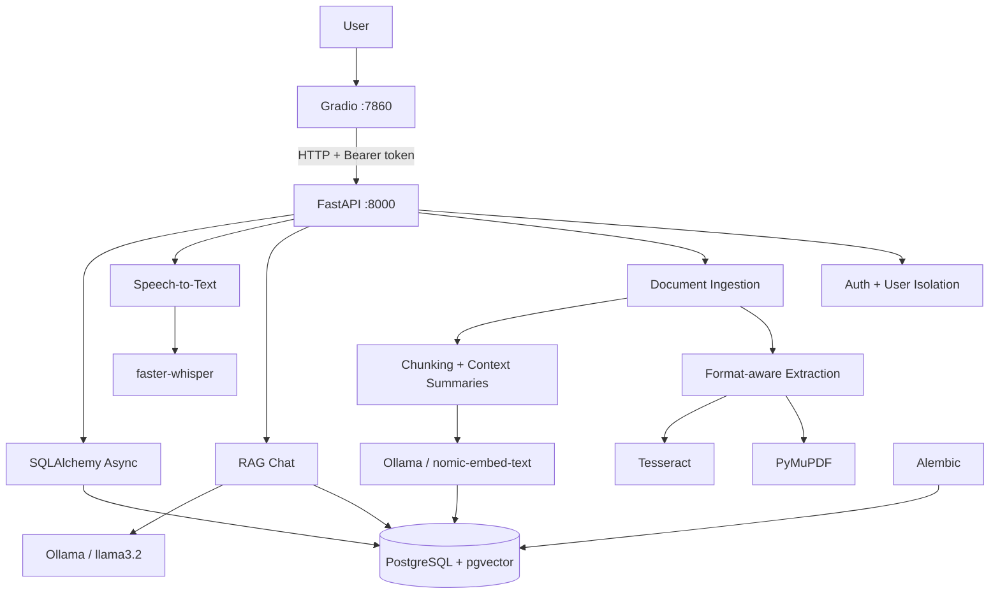
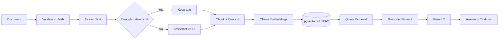

<div align="center">

# 🧠 RAG Document Assistant

### Local-first document intelligence with RAG, OCR, speech-to-text, vector search, and private LLM inference.

Upload documents, extract native or scanned content, build semantic vectors, ask grounded questions, continue conversations, use voice queries, and receive traceable answers — through a Dockerized FastAPI + Gradio application.

<p>
  
  
  
  
  
  
</p>

</div>

## 🎥 Demo

[▶ Watch the RAG Document Assistant demo](https://github.com/user-attachments/assets/1405cbca-9955-4bce-a0ab-7c2c6cd94b9d)

## ✨ What Makes It More Than a Basic RAG Demo

| Capability | Implementation |
|---|---|
| Documents | PDF, DOCX, TXT, Markdown, CSV, HTML, JSON |
| OCR | PyMuPDF extraction + selective Tesseract fallback |
| Chunking | Page-aware chunks + overlap + rolling context summaries |
| Retrieval | Ollama embeddings + pgvector + HNSW cosine search |
| Generation | Local `llama3.2` + grounded prompts + citations |
| Voice | Local `faster-whisper` speech-to-text |
| Conversations | Memory + follow-up resolution + SSE streaming |
| Security | PBKDF2-SHA256 + bearer tokens + user-scoped retrieval |
| Infrastructure | Async FastAPI + Gradio + PostgreSQL + Docker + Alembic |

The result is a private, multi-user document workspace where ingestion, retrieval, generation, OCR, audio, authentication, and persistence work together in one system.

## 🏗️ Architecture



## 🤖 AI Pipeline



### Ingestion & OCR

Supported formats: `PDF`, `DOCX`, `TXT`, `Markdown`, `CSV`, `HTML`, `JSON`.

PDFs first use **PyMuPDF native extraction**. Pages with insufficient extracted text fall back to **Tesseract OCR**, avoiding unnecessary OCR on normal text PDFs while supporting scanned and mixed documents. Extraction-source metadata is preserved.

### Context-aware chunking

The chunker combines **physical overlap** with **rolling context summaries**. Overlap preserves boundary text; summaries provide semantic continuity to later chunks without duplicating the full document history.

### Embeddings & retrieval

```text
nomic-embed-text → 768-d embedding → PostgreSQL/pgvector → HNSW cosine search
```

Chunks retain text, page/chunk metadata, hashes, summaries, embeddings, and document ownership. Because vectors and relational data live in PostgreSQL, retrieval can combine semantic similarity with authenticated user ownership, selected documents, processing status, top-k limits, and relevance thresholds.

At query time, the system resolves intent/follow-ups, embeds the question, retrieves relevant chunks, and injects them into a grounded `llama3.2` prompt. Uploaded documents **are not used to retrain the LLM**; answers are generated from retrieved evidence with source metadata for traceability.

## 🎙️ Voice Queries

```text
Voice → faster-whisper → text query → embedding → retrieval → LLM → cited answer
```

Voice input is processed locally with **faster-whisper**, with CPU/`int8` support, optional language selection, VAD, validation/size limits, and persistent model caching. Transcribed text can be reviewed before retrieval.

## 🔐 Security & Conversations

The application uses a user-scoped workspace rather than a global document pool:

- PBKDF2-SHA256 password hashing with random salts
- Signed bearer tokens with expiration
- User-scoped documents, conversations, and vector retrieval
- Per-user duplicate checks
- Persistent multi-turn conversation history
- Follow-up resolution using previous context
- Lightweight intent routing to bypass unnecessary retrieval
- SSE response streaming
- Source-aware answers with filename, page, chunk, score, and excerpts

## 🧠 Local AI

| Task | Default model |
|---|---|
| Embeddings | `nomic-embed-text` |
| Generation | `llama3.2` |
| Speech-to-text | `faster-whisper` |

Ollama provides local embeddings and generation; the Dockerized backend reaches host Ollama through `host.docker.internal:11434`. Configuration includes practical controls for model keep-alive, warmup, context window, token limits, timeouts, retrieved-context caps, and relevance thresholds. OpenAI is also supported through the provider abstraction.

## 🧰 Tech Stack

| Layer | Technology |
|---|---|
| Language | Python 3.12 |
| Frontend / API | Gradio / FastAPI |
| Database | PostgreSQL + pgvector |
| ORM / Migrations | SQLAlchemy Async / Alembic |
| LLM / Embeddings | Ollama / `llama3.2` / `nomic-embed-text` |
| OCR / Extraction | Tesseract / PyMuPDF / python-docx / pandas / BeautifulSoup |
| STT | faster-whisper |
| Containers | Docker + Docker Compose |
| Testing | pytest / pytest-asyncio |
| Quality / CI | Ruff / mypy / GitHub Actions |

## 🚀 Getting Started

### Prerequisites

Install **Docker Desktop with Docker Compose**, **Ollama**, and Git. Tesseract is installed in the backend image.

### 1. Clone and configure

```bash
git clone <YOUR_REPOSITORY_URL>
cd RAG-Document-Assistant
cp .env.example .env
```

On Windows Command Prompt:

```bat
copy .env.example .env
```

Set at minimum:

```env
AUTH_SECRET_KEY=replace_with_a_long_random_secret
POSTGRES_PASSWORD=replace_with_a_database_password
```

### 2. Pull models

```bash
ollama pull llama3.2
ollama pull nomic-embed-text
```

### 3. Start

```bash
docker compose up --build -d
docker compose ps
```

### 4. Open

| Service | URL |
|---|---|
| Gradio | `http://127.0.0.1:7860` |
| API docs | `http://127.0.0.1:8000/docs` |
| Health | `http://127.0.0.1:8000/api/v1/health` |

Stop with `docker compose down`.

> Avoid `docker compose down -v` unless you intentionally want to delete PostgreSQL data, uploaded documents, and cached Whisper models.

## 🧪 Quality & Engineering

The project includes unit, integration, security, and E2E tests, database migrations, type checking, linting, and GitHub Actions checks.

```bash
pytest
ruff check .
mypy .
```

<details>
<summary>Key engineering decisions</summary>

**Selective OCR:** OCR only runs when native PDF extraction is insufficient, balancing coverage and speed.

**PostgreSQL + pgvector:** Relational data and embeddings share one database, allowing vector similarity to be combined with application-level constraints.

**HNSW:** Approximate nearest-neighbour indexing keeps vector retrieval efficient as the corpus grows.

**Rolling context summaries:** Later chunks retain semantic continuity without repeatedly embedding the full preceding document.

**Local Ollama:** Documents, queries, embeddings, and generation can remain local while exposing controls for constrained hardware.

</details>

## 📌 What This Project Demonstrates

A production-oriented RAG system is more than an LLM call. This project combines **document processing, selective OCR, context-aware chunking, vector search, grounded generation, speech-to-text, authentication, multi-user isolation, async APIs, database migrations, Docker, testing, and CI** into one reproducible application.
