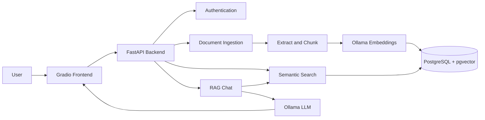
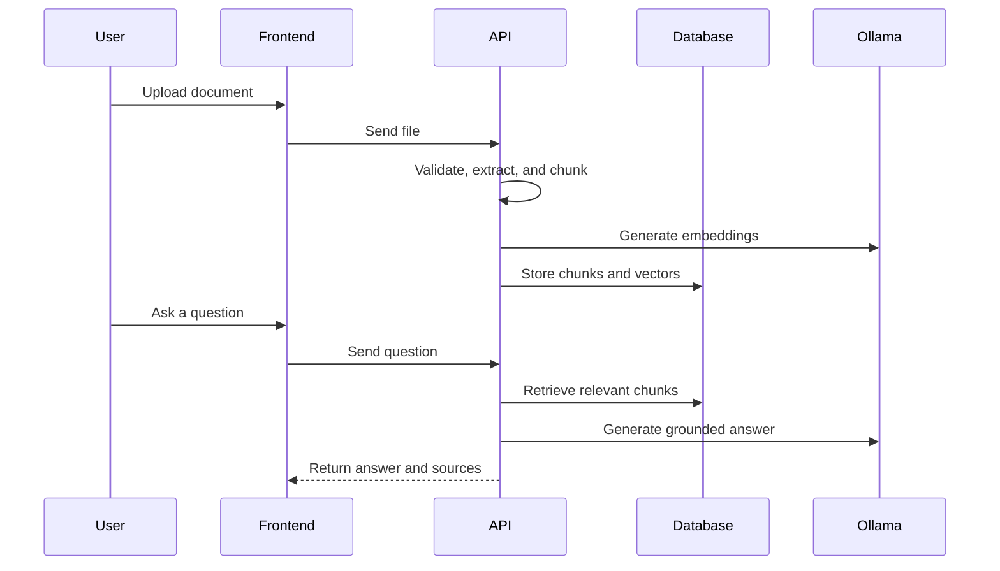

<div align="center">

# 📚 Document Assistant

### Secure, local document search and grounded AI chat

A multi-user RAG application built with **FastAPI**, **Gradio**,  
**PostgreSQL + pgvector**, and **Ollama**


</div>

---

## Overview

Document Assistant allows users to upload documents and ask questions about their contents.

Documents are validated, converted into searchable text chunks, embedded locally with Ollama, and stored in PostgreSQL using pgvector. Relevant chunks are retrieved for each question so the generated response stays grounded in the uploaded documents.

Every user has private documents, conversations, and messages.

## Features

- Secure signup, login, and bearer-token authentication
- Private documents and conversations for each user
- PDF, DOCX, TXT, Markdown, CSV, HTML, and JSON support
- File validation, upload limits, and duplicate detection
- Text extraction, chunking, embedding, and indexing
- Semantic search with PostgreSQL and pgvector
- Local embeddings and responses through Ollama
- Grounded answers with citations and source references
- Conversation and message history
- Document status, reprocessing, and deletion
- Standardized API errors and request tracing
- Swagger documentation, health checks, and automated tests
- Gradio frontend with microphone controls

> Speech-to-text is the next planned feature. The microphone UI exists, but it is not yet connected to a transcription API.

## Architecture



## Technology

| Layer | Technology |
|---|---|
| Frontend | Gradio |
| Backend | FastAPI and Pydantic |
| Database | PostgreSQL |
| Vector search | pgvector |
| ORM and migrations | SQLAlchemy and Alembic |
| Embeddings and LLM | Ollama |
| Testing | Pytest |
| Formatting and linting | Ruff |
| Containers | Docker Compose |

## Quick Start

### Requirements

Install:

- Python 3.11 or newer
- Git
- Docker Desktop
- Ollama

The commands below are written for Windows with Git Bash.

### 1. Clone the repository

```bash
git clone https://github.com/fizzahussain/rag-document-assistant.git
cd rag-document-assistant
```

### 2. Create the environment file

```bash
cp .env.example .env
```

Set a long secret in `.env`:

```env
AUTH_SECRET_KEY=replace-with-a-long-random-secret
```

Never commit `.env`.

### 3. Download the Ollama models

```bash
ollama pull nomic-embed-text
ollama pull llama3.2
```

Confirm they are installed:

```bash
ollama list
```

### 4. Start PostgreSQL

```bash
docker compose up -d postgres
```

### 5. Create the Python environment

```bash
python -m venv .venv
source .venv/Scripts/activate
```

### 6. Install dependencies

```bash
pip install -r backend/requirements.txt
pip install -r frontend/requirements.txt
```

### 7. Apply database migrations

```bash
alembic -c backend/alembic.ini upgrade head
```

### 8. Start the backend

```bash
uvicorn backend.app.main:app --reload --host 127.0.0.1 --port 8000
```

### 9. Start the frontend

Open another terminal:

```bash
source .venv/Scripts/activate
python frontend/app.py
```

Open the application:

- Frontend: `http://127.0.0.1:7860`
- Swagger API: `http://127.0.0.1:8000/docs`
- OpenAPI schema: `http://127.0.0.1:8000/openapi.json`

## How It Works



## API

All application routes use the `/api/v1` prefix.

| Area | Endpoint |
|---|---|
| Authentication | `/api/v1/auth` |
| Documents | `/api/v1/documents` |
| Search | `/api/v1/search` |
| Chat | `/api/v1/chat` |
| Conversations | `/api/v1/conversations` |
| Health | `/api/v1/health` |
| Readiness | `/api/v1/ready` |

Protected endpoints require:

```http
Authorization: Bearer <access-token>
```

API errors use a consistent structure:

```json
{
  "error_code": "VALIDATION_ERROR",
  "message": "The provided data is invalid",
  "request_id": "request-id",
  "details": {}
}
```

## Docker

With Ollama running on the host:

```bash
docker compose up --build
```

Stop the application:

```bash
docker compose down
```

## Development

Run all backend checks:

```bash
ruff format backend
ruff check backend
python -m compileall -q backend
pytest -q
```

Apply safe Ruff fixes:

```bash
ruff check backend --fix
```

## Project Structure

```text
rag-document-assistant/
├── backend/
│   ├── alembic/
│   ├── app/
│   │   ├── api/endpoints/
│   │   ├── core/
│   │   ├── models/
│   │   ├── schemas/
│   │   ├── services/
│   │   ├── config.py
│   │   ├── database.py
│   │   └── main.py
│   ├── tests/
│   └── requirements.txt
├── frontend/
│   ├── app.py
│   └── requirements.txt
├── docker-compose.yml
├── pyproject.toml
└── README.md
```

## Roadmap

- [x] Multi-user authentication
- [x] Private documents and conversations
- [x] Document ingestion and validation
- [x] pgvector semantic search
- [x] Local Ollama embeddings and answers
- [x] Citations and source references
- [x] Standardized API errors
- [x] Backend test coverage
- [ ] Microphone transcription API
- [ ] Local faster-whisper integration
- [ ] Streaming responses
- [ ] Background document processing

## Security

The application includes password hashing, signed access tokens, user-scoped database queries, ownership checks, safe error responses, and upload validation.

Do not commit:

```text
.env
.venv/
data/
__pycache__/
.pytest_cache/
.ruff_cache/
```

See [SECURITY.md](SECURITY.md) for vulnerability reporting.

## Contributing

Read [CONTRIBUTING.md](CONTRIBUTING.md) before submitting a pull request.

## License

This project is licensed under the terms in [LICENSE](LICENSE).

---

<div align="center">

**Built for private, local, and grounded document intelligence**

</div>