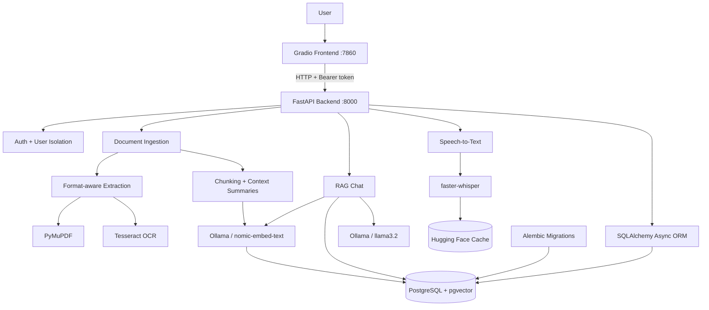
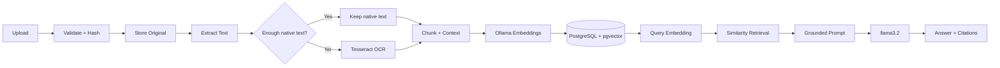

<div align="center">

# 🧠 RAG Document Assistant

### Local-first document intelligence with RAG, OCR, speech-to-text, vector search, and private LLM inference.

Upload documents, extract native or scanned content, build semantic vectors, ask grounded questions, continue multi-turn conversations, speak queries by voice, and receive traceable answers — through a Dockerized FastAPI + Gradio application.

<p>
  
  
  
  
  
  
</p>

</div>

## 🎥 Demo

[▶ Watch the RAG Document Assistant demo](https://github.com/user-attachments/assets/1405cbca-9955-4bce-a0ab-7c2c6cd94b9d)

## ✨ Why This Is More Than a Basic RAG Demo

A typical RAG demo connects a document loader, vector store, and LLM. This project treats RAG as a **complete application pipeline**: reliable ingestion, selective OCR, context construction, vector indexing, retrieval constraints, grounded generation, conversation state, multimodal input, authentication, persistence, evaluation, and containerized deployment.

| Area | Implementation |
|---|---|
| 📄 Documents | PDF, DOCX, TXT, Markdown, CSV, HTML, JSON; validation, hashing, duplicate detection, page metadata |
| 👁️ OCR | PyMuPDF native extraction + selective Tesseract fallback for scanned/mixed PDFs |
| 🧩 Chunking | Page-aware chunks + physical overlap + rolling context summaries |
| 🔎 Retrieval | `nomic-embed-text` + 768-d vectors + pgvector + HNSW cosine search |
| 💬 Generation | Local `llama3.2` + grounded prompts + source citations + conversation memory |
| 🎙️ Voice | Local `faster-whisper` + VAD + CPU/`int8` support + model caching |
| 🔐 Security | PBKDF2-SHA256 + salted passwords + bearer tokens + user-scoped retrieval |
| ⚙️ Backend | Async FastAPI + SQLAlchemy + Alembic + PostgreSQL + SSE streaming |
| 🐳 Infrastructure | Docker Compose + persistent volumes + health-aware startup + GitHub Actions |

---

## 🏗️ System Architecture



## 🤖 End-to-End AI Pipeline



### 📄 Ingestion & Selective OCR

Supported formats: `PDF` · `DOCX` · `TXT` · `Markdown` · `CSV` · `HTML` · `JSON`.

PDF processing uses a **two-stage extraction strategy**:

1. **PyMuPDF** first extracts native PDF text.
2. The extracted character count is checked against a configurable threshold.
3. Pages with weak/empty extraction are rendered for OCR.
4. **Tesseract** processes those pages, with a CLI fallback when needed.
5. The richer result is retained and the extraction source is recorded in metadata.

This avoids paying the OCR cost for normal text PDFs while still handling scanned and mixed documents.

### 🧩 Context-Aware Chunking

The chunker combines two different continuity mechanisms:

- **Physical overlap** preserves real text across chunk boundaries.
- **Rolling context summaries** give later chunks semantic continuity without repeatedly duplicating the entire document history.

```text
Document → page-aware extraction
          ↓
Chunk 0 ── overlap ──→ Chunk 1 + prior summary
                              ↓
                         Chunk 2 + prior summary
                              ↓
                        semantic embedding
```

This matters because chunking is not just a preprocessing step: **what information reaches the retriever directly affects RAG quality.**

### 🔎 Embeddings, pgvector & HNSW

```text
nomic-embed-text → 768-dimensional embedding
                 → PostgreSQL + pgvector
                 → HNSW cosine-distance index
```

Each searchable chunk retains extracted text, page/chunk metadata, hashes, rolling context summaries, embeddings, and document ownership. Storing vectors alongside relational data allows retrieval to combine semantic similarity with **user ownership, document status, selected documents, top-k limits, and relevance thresholds**.

### 💬 Retrieval-Augmented Generation

At query time, the system can resolve intent and follow-ups, embed the question, retrieve relevant chunks, and inject them into a grounded `llama3.2` prompt. The model is instructed not to invent document facts when evidence is insufficient, while source metadata is preserved for traceability.

**Uploaded documents are not used to retrain the LLM.** RAG supplies relevant evidence at query time through context injection.

## 🎙️ Voice Queries

```text
Voice → faster-whisper → text query → embedding → retrieval → LLM → cited answer
```

Voice input is processed locally with **faster-whisper**, supporting microphone/audio uploads, CPU execution, `int8` compute, optional language selection, configurable beam search, VAD, audio validation/size limits, and persistent Hugging Face model caching. Transcribed text is placed in the composer for review before retrieval.

## 🔐 Security & Conversation Intelligence

The application is a **multi-user document workspace**, not a global document pool.

- PBKDF2-SHA256 password hashing with random salts
- Signed bearer tokens with expiration
- Authenticated document and conversation ownership
- User-scoped vector retrieval and per-user duplicate checks
- Persistent multi-turn conversation history
- Follow-up resolution — e.g. “Explain the third point” can use previous context before retrieval
- Lightweight intent routing so greetings, thanks, farewells, and calculation-like messages can bypass unnecessary retrieval
- **Server-Sent Events (SSE)** for progressive response streaming
- Source-aware results preserving filename, page, chunk index, score, and excerpts

The authenticated user is applied as a retrieval constraint **before document chunks are returned**, making isolation part of the retrieval layer rather than only a UI feature.

## 🧠 Local AI Architecture

| Task | Default model |
|---|---|
| Embeddings | `nomic-embed-text` |
| Generation | `llama3.2` |
| Speech-to-text | `faster-whisper` |

Ollama handles local embeddings and generation. The Dockerized backend reaches host Ollama through `host.docker.internal:11434`.

The application exposes practical controls for **model keep-alive, startup warmup, context-window size, maximum predicted tokens, timeouts, retrieved-context caps, summary caps, and relevance thresholds** — important when running local models on constrained hardware. A provider abstraction also supports OpenAI for embeddings and/or generation.

## 🐳 Docker & Infrastructure

Docker is part of the system design rather than just packaging.

| Service | Purpose | Port |
|---|---|---:|
| `postgres` | PostgreSQL + pgvector | `5432` |
| `backend` | FastAPI application | `8000` |
| `frontend` | Gradio interface | `7860` |
| Ollama | Local models on host | `11434` |

Compose provides service discovery (`postgres:5432`), while the backend reaches host Ollama through `host.docker.internal`. Named volumes persist **database/vector state, uploaded documents, and Whisper model cache**. Health checks make the backend wait for PostgreSQL and the frontend depend on backend readiness.

## 💡 Key Engineering Decisions

| Decision | Why |
|---|---|
| **Selective OCR** | Avoid expensive OCR when native PDF text is already usable |
| **Physical overlap + rolling summaries** | Preserve boundary text while maintaining semantic continuity |
| **PostgreSQL + pgvector** | Combine vector search with relational application constraints |
| **HNSW** | Efficient approximate nearest-neighbor retrieval as the corpus grows |
| **Local Ollama** | Keep documents, embeddings, and generation local and controllable |
| **SSE streaming** | Return generated responses progressively instead of waiting for completion |
| **User-scoped retrieval** | Prevent cross-user document leakage at the retrieval layer |
| **Provider abstraction** | Support local inference while retaining an OpenAI path |

## 📊 RAG Evaluation

The project includes `scripts/evaluate_rag.py` with a small retrieval evaluation dataset. It checks whether expected context is actually retrieved for known questions, giving the system an explicit way to assess **retrieval quality** rather than judging it only by whether the LLM produced an answer.

```text
Question
   ↓
Retriever
   ↓
Retrieved chunks
   ↓
Expected context retrieved?
   ↓
Retrieval evaluation
```

## 🧰 Technology Stack

| Layer | Technology | Role |
|---|---|---|
| Language | **Python 3.12** | Core application and AI pipeline |
| Frontend / API | **Gradio / FastAPI** | UI, typed async REST API, OpenAPI |
| Database | **PostgreSQL + pgvector** | Relational + semantic storage |
| ORM / Migrations | **SQLAlchemy Async / Alembic** | Persistence and schema evolution |
| LLM / Embeddings | **Ollama / llama3.2 / nomic-embed-text** | Local generation and embeddings |
| OCR / Extraction | **Tesseract / PyMuPDF / python-docx / pandas / BeautifulSoup** | Document processing |
| STT | **faster-whisper** | Local voice transcription |
| HTTP | **httpx** | Async service/provider communication |
| Containers | **Docker + Docker Compose** | Reproducible services |
| Testing | **pytest / pytest-asyncio** | Unit, integration, security, E2E |
| Quality / CI | **Ruff / mypy / GitHub Actions** | Code quality and automated checks |

## 🧪 Testing & Quality

Testing covers **API behavior, authentication, security boundaries, chunking, embeddings, extraction/OCR, context features, pgvector retrieval, and end-to-end RAG workflows**.

```bash
pytest
ruff check .
ruff format --check .
mypy backend frontend
```

## 🚀 Getting Started

### Prerequisites

Install **Docker Desktop + Compose**, **Ollama**, and Git. Tesseract is installed in the backend image.

### 1. Clone and configure

```bash
git clone <YOUR_REPOSITORY_URL>
cd RAG-Document-Assistant
cp .env.example .env
```

On Windows Command Prompt:

```bat
copy .env.example .env
```

Set at minimum:

```env
AUTH_SECRET_KEY=replace_with_a_long_random_secret
POSTGRES_PASSWORD=replace_with_a_database_password
```

Generate a strong secret with `openssl rand -hex 32` and never commit the real `.env`.

### 2. Pull models and start

```bash
ollama pull llama3.2
ollama pull nomic-embed-text

docker compose up --build -d
docker compose ps
```

### 3. Open the application

| Service | URL |
|---|---|
| Gradio | `http://127.0.0.1:7860` |
| FastAPI docs | `http://127.0.0.1:8000/docs` |
| API health | `http://127.0.0.1:8000/api/v1/health` |
| API readiness | `http://127.0.0.1:8000/api/v1/ready` |

Stop with `docker compose down`.

> Avoid `docker compose down -v` unless you intentionally want to delete PostgreSQL data, uploaded documents, and cached Whisper models.

## 📁 Repository Structure

```text
RAG-Document-Assistant/
├── backend/
│   ├── app/
│   │   ├── api/endpoints/        # auth, documents, chat, search, audio, health
│   │   ├── core/                 # security, logging, exceptions
│   │   ├── models/               # SQLAlchemy models
│   │   ├── schemas/              # typed API contracts
│   │   └── services/             # RAG, OCR, STT, storage, retrieval, LLM
│   ├── migrations/               # Alembic + pgvector/HNSW migrations
│   └── Dockerfile
├── frontend/                     # Gradio workspace
├── scripts/                      # evaluation dataset + RAG evaluator
├── docs/                         # architecture, AI pipeline, testing notes
├── tests/                        # automated test suite
├── docker-compose.yml
├── .env.example
├── pyproject.toml
└── README.md
```

## 📌 What This Project Demonstrates

A production-oriented RAG system is more than an LLM call. This project combines **document processing, selective OCR, context-aware chunking, vector search, grounded generation, speech-to-text, authentication, multi-user isolation, async APIs, database migrations, Docker, testing, retrieval evaluation, and CI** into one reproducible application.

The emphasis is on **building the complete system around the model** — not just connecting an LLM to a document upload button.
