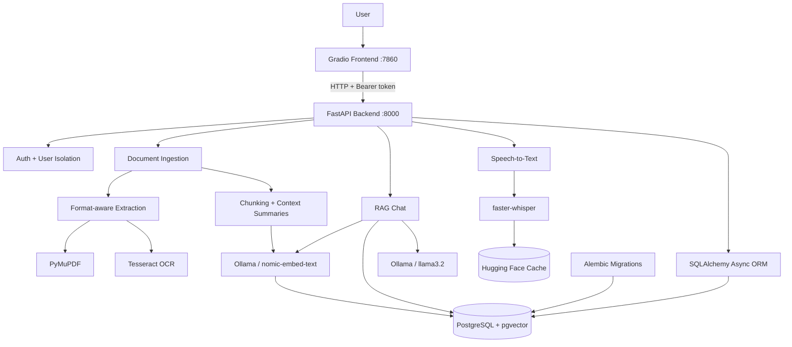
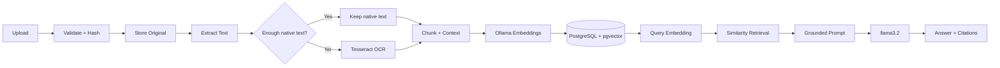

<div align="center">

# 🧠 RAG Document Assistant

### Local-first document intelligence with RAG, OCR, speech-to-text, vector search, and private LLM inference.

Upload documents, extract native or scanned content, index semantic vectors, ask grounded questions, continue multi-turn conversations, speak queries by voice, and receive traceable answers — through a Dockerized FastAPI + Gradio application.

<p>
  
  
  
  
  
  
</p>

</div>

## 🎥 Demo

[▶ Watch the RAG Document Assistant demo](https://github.com/user-attachments/assets/1405cbca-9955-4bce-a0ab-7c2c6cd94b9d)

## ✨ Why This Is More Than a Basic RAG Demo

This project brings document intelligence, retrieval, local AI, multimodal input, security, persistence, and deployment into one system.

| Area | What it does |
|---|---|
| 📄 Documents | PDF, DOCX, TXT, Markdown, CSV, HTML, JSON; validation, hashing, duplicate checks, page metadata |
| 👁️ OCR | PyMuPDF native extraction with selective Tesseract fallback for scanned/mixed PDFs |
| 🔎 Retrieval | Context-aware chunking, physical overlap, rolling summaries, `nomic-embed-text`, pgvector, HNSW |
| 💬 Generation | Local `llama3.2`, grounded prompts, source citations, conversation memory, follow-up resolution |
| 🎙️ Voice | Local `faster-whisper`, VAD, CPU/`int8` support, cached models |
| 🔐 Security | PBKDF2-SHA256, salted passwords, bearer tokens, expiration, user-scoped retrieval |
| ⚙️ Backend | Async FastAPI, SQLAlchemy, Alembic, PostgreSQL, SSE streaming |
| 🐳 Infrastructure | Docker Compose, persistent volumes, health-aware startup, GitHub Actions |

The goal is not just to make a chatbot answer questions, but to build the **complete system around the model**: reliable ingestion, retrieval quality, grounding, traceability, privacy, and reproducible infrastructure.

## 🏗️ System Architecture



## 🤖 End-to-End AI Pipeline



### 1. Format-aware ingestion & selective OCR

Supported formats: `PDF` · `DOCX` · `TXT` · `Markdown` · `CSV` · `HTML` · `JSON`.

PDFs first use **PyMuPDF native extraction**. OCR is not blindly applied to every page: a page falls back to **Tesseract only when native text is below a configured threshold**. This keeps normal text PDFs fast while supporting scanned and mixed documents. Extraction-source metadata is retained, with a Tesseract CLI fallback when needed.

### 2. Context-aware chunking

The chunker deliberately combines two ideas that are often treated as the same thing:

- **Physical overlap** preserves real boundary text across adjacent chunks.
- **Rolling context summaries** give later chunks semantic continuity without duplicating the full document history.

```text
Document → page-aware extraction
          ↓
Chunk 0 ── overlap ──→ Chunk 1 + prior summary
                              ↓
                         Chunk 2 + prior summary
                              ↓
                        semantic embedding
```

### 3. Embeddings + vector search

```text
nomic-embed-text → 768-dimensional embedding
                 → PostgreSQL + pgvector
                 → HNSW cosine-distance index
```

Each searchable chunk retains extracted text, page/chunk metadata, hash, rolling context summary, embedding, and document ownership. Keeping vectors and relational data together lets retrieval combine semantic similarity with **user ownership, document status, selected documents, top-k limits, and relevance thresholds**.

### 4. Retrieval-Augmented Generation

At query time, the system can resolve intent and follow-ups, embed the question, retrieve relevant chunks, and inject them into a grounded prompt for `llama3.2`. The prompt instructs the model not to invent document facts when evidence is insufficient, and source metadata is preserved for traceable answers.

**Uploaded files are not used to retrain the LLM.** RAG supplies relevant evidence at query time.

## 🎙️ Voice Queries

```text
Voice → faster-whisper → text query → embedding → retrieval → LLM → cited answer
```

Voice input is processed locally with **faster-whisper**, including microphone/audio upload, CPU execution, `int8` compute, optional language selection, configurable beam search, VAD, audio validation/size limits, and persistent Hugging Face model caching. Transcribed text is placed in the composer for review before retrieval.

## 🧠 Local AI with Ollama

| AI task | Default model |
|---|---|
| Embeddings | `nomic-embed-text` |
| Generation | `llama3.2` |
| Speech transcription | `faster-whisper` |

Ollama handles local embeddings and generation. Because Ollama runs on the host, the Dockerized backend connects through `host.docker.internal:11434`.

The application exposes practical controls for **model keep-alive, startup warmup, context-window size, maximum predicted tokens, timeouts, retrieved-context caps, summary caps, and relevance thresholds** — important when running local models on CPU-constrained hardware. A provider abstraction also supports OpenAI for embeddings and/or generation.

## 🔐 Security & Conversation Intelligence

The application is a **multi-user document workspace**, not a global document pool.

- PBKDF2-SHA256 password hashing with random salts
- Signed bearer tokens and token expiration
- Authenticated document and conversation ownership
- User-scoped vector retrieval and per-user duplicate checks
- Persistent multi-turn conversation history
- Follow-up resolution, e.g. references such as “Explain the third point” can use previous context before retrieval
- Lightweight intent routing so greetings, thanks, farewells, and calculation-like messages can bypass unnecessary retrieval
- **Server-Sent Events (SSE)** for progressive response streaming
- Source-aware results preserving filename, page, chunk index, score, and excerpts

The authenticated user is applied as a retrieval constraint **before document chunks are returned**, making data isolation part of the retrieval layer rather than only a UI feature.

## 🐳 Docker & Infrastructure

Docker is part of the system design rather than just packaging.

| Service | Purpose | Port |
|---|---|---:|
| `postgres` | PostgreSQL + pgvector | `5432` |
| `backend` | FastAPI application | `8000` |
| `frontend` | Gradio interface | `7860` |
| Ollama | Local models on host | `11434` |

Compose provides service discovery (`postgres:5432`), while the backend reaches host Ollama through `host.docker.internal`. Named volumes persist **database/vector state, uploaded documents, and Whisper model cache**. Health checks make the backend wait for PostgreSQL and the frontend depend on backend readiness.

## 🧰 Technology Stack

| Layer | Technology | Role |
|---|---|---|
| Language | **Python 3.12** | Core application and AI pipeline |
| Frontend / API | **Gradio / FastAPI** | UI, typed async REST API, OpenAPI |
| Database | **PostgreSQL + pgvector** | Relational + semantic storage |
| ORM / Migrations | **SQLAlchemy Async / Alembic** | Persistence and schema evolution |
| LLM / Embeddings | **Ollama / llama3.2 / nomic-embed-text** | Local generation and embeddings |
| OCR / Extraction | **Tesseract / PyMuPDF / python-docx / pandas / BeautifulSoup** | Document processing |
| STT | **faster-whisper** | Local voice transcription |
| HTTP | **httpx** | Async service/provider communication |
| Containers | **Docker + Docker Compose** | Reproducible services |
| Testing | **pytest / pytest-asyncio** | Unit, integration, security, E2E |
| Quality / CI | **Ruff / mypy / GitHub Actions** | Code quality and automated checks |

## 🚀 Getting Started

### Prerequisites

Install **Docker Desktop + Compose**, **Ollama**, and Git. Tesseract is installed in the backend image.

### 1. Clone and configure

```bash
git clone <YOUR_REPOSITORY_URL>
cd RAG-Document-Assistant
cp .env.example .env
```

On Windows Command Prompt:

```bat
copy .env.example .env
```

Set at minimum:

```env
AUTH_SECRET_KEY=replace_with_a_long_random_secret
POSTGRES_PASSWORD=replace_with_a_database_password
```

Generate a strong secret with `openssl rand -hex 32` and never commit the real `.env`.

### 2. Pull models and start

```bash
ollama pull llama3.2
ollama pull nomic-embed-text

docker compose up --build -d
docker compose ps
```

### 3. Open the application

| Service | URL |
|---|---|
| Gradio | `http://127.0.0.1:7860` |
| FastAPI docs | `http://127.0.0.1:8000/docs` |
| API health | `http://127.0.0.1:8000/api/v1/health` |
| API readiness | `http://127.0.0.1:8000/api/v1/ready` |

Stop with `docker compose down`.

> Avoid `docker compose down -v` unless you intentionally want to delete PostgreSQL data, uploaded documents, and cached Whisper models.

## 🧪 Testing, Evaluation & Quality

Testing covers **API behavior, authentication, security boundaries, chunking, embeddings, extraction/OCR, context features, pgvector retrieval, and end-to-end RAG workflows**.

```bash
pytest
ruff check .
ruff format --check .
mypy backend frontend
```

The repository also includes `scripts/evaluate_rag.py`, which runs a small retrieval evaluation dataset and reports whether expected context was retrieved. This gives the system an explicit way to assess **retrieval quality**, rather than judging it only by whether the UI produces an answer.

## 📁 Repository Structure

```text
RAG-Document-Assistant/
├── backend/
│   ├── app/
│   │   ├── api/endpoints/        # auth, documents, chat, search, audio, health
│   │   ├── core/                 # security, logging, exceptions
│   │   ├── models/               # SQLAlchemy models
│   │   ├── schemas/              # typed API contracts
│   │   └── services/             # RAG, OCR, STT, storage, retrieval, LLM
│   ├── migrations/               # Alembic + pgvector/HNSW migrations
│   └── Dockerfile
├── frontend/                     # Gradio workspace
├── scripts/                      # evaluation dataset + RAG evaluator
├── docs/                         # architecture, AI pipeline, testing notes
├── tests/                        # automated test suite
├── docker-compose.yml
├── .env.example
├── pyproject.toml
└── README.md
```

## 💡 Key Engineering Lessons

This project made several AI concepts practical rather than theoretical:

- **RAG quality is a pipeline problem:** extraction, chunk size, overlap, summaries, embeddings, similarity, top-k, thresholds, grounding, and conversation context all affect the final answer.
- **OCR should be selective:** native PDF text is faster and cleaner when available; scanned pages need a fallback path.
- **Vectors are application data:** pgvector, cosine similarity, relational filters, and HNSW are part of the backend—not just an AI add-on.
- **Local AI creates real engineering constraints:** model warmup, context length, CPU execution, quantization, latency, and token limits become visible immediately.
- **Multimodal systems add infrastructure concerns:** faster-whisper introduces audio validation, VAD, caching, execution-device choices, and latency trade-offs.
- **Security belongs in retrieval:** authentication alone is not enough; ownership must constrain which chunks can ever enter a user's context.
- **Production-oriented AI is mostly systems engineering:** async APIs, typed schemas, migrations, health checks, Docker, tests, evaluation, logging, and CI all matter around the model.

The emphasis throughout is on **building the complete system around the model**, not just connecting an LLM to a document upload button.
