# RAG Document Assistant

> A private, multi-user Retrieval-Augmented Generation (RAG) workspace for uploading documents, extracting and indexing their content, and asking grounded questions with local AI models.

This project combines **FastAPI**, **Gradio**, **PostgreSQL + pgvector**, **Ollama**, **Tesseract OCR**, and **faster-whisper** into a complete local document assistant. It supports authenticated users, document ingestion, selective OCR, context-aware chunking, vector retrieval, conversation memory, source-aware answers, document lifecycle actions, and voice input.

---

## Overview

A normal language model does not automatically know the contents of a user's private PDFs or notes. This application solves that problem with Retrieval-Augmented Generation.

Instead of retraining the model, uploaded documents are processed once and stored as searchable vector embeddings. When a user asks a question, the system retrieves only the most relevant document chunks and gives them to the local LLM as grounded context.

```text
Upload document
      ↓
Validate and store
      ↓
Extract text
      ↓
Selective OCR when needed
      ↓
Chunk with physical overlap
      ↓
Add rolling previous-context summaries
      ↓
Create embeddings
      ↓
Store vectors in PostgreSQL + pgvector
      ↓
Document becomes searchable

User question
      ↓
Resolve conversation context
      ↓
Create question embedding
      ↓
Vector similarity search
      ↓
Retrieve top relevant chunks
      ↓
Build grounded LLM prompt
      ↓
Generate answer with Ollama
      ↓
Return answer + sources
```

---

# Core Features

## Document ingestion

- Multi-file document upload
- User-specific document ownership
- File size and extension validation
- File-content validation instead of trusting extensions alone
- File hashing for duplicate upload detection
- Persistent original-file storage
- Processing status tracking
- Failure metadata and retry support
- Authenticated document viewing
- Delete confirmation and document cleanup

## Extraction and OCR

- Native PDF text extraction with PyMuPDF
- Selective per-page OCR using Tesseract
- OCR only when native text extraction is insufficient
- Page metadata preserved for later source attribution
- Support for text-oriented document formats handled by the extraction layer

## Context-aware chunking

- Real physical overlap between adjacent chunks
- Rolling previous-context summaries
- Page-aware chunk metadata
- Stable chunk indexing
- Chunk hashing / identity handling
- Separation between local overlap and broader semantic context

Physical overlap and rolling summaries are intentionally different:

- **Physical overlap** repeats some real text across chunk boundaries so information is not lost when a sentence or idea crosses a split
- **Rolling context** gives later chunks a compact description of what came before without copying the entire document history

## Retrieval-Augmented Generation

- Local semantic embeddings through Ollama
- `nomic-embed-text` embedding model
- 768-dimensional embeddings
- PostgreSQL vector storage through pgvector
- Similarity-based retrieval
- Top-k relevant chunk selection
- Optional restriction to selected documents
- `@document` selection from the message composer
- Grounded answer generation with `llama3.2`
- Source information attached to answers

## Conversation experience

- Persistent conversations
- Multi-turn conversation memory
- Follow-up question handling
- Context-aware references such as "the second point" or "explain that"
- New conversation workflow
- Conversation deletion
- Clickable starter prompts
- Inline source display

## Voice input

- Microphone recording from the frontend
- Speech-to-text through faster-whisper
- CPU inference support
- INT8 compute mode
- Voice Activity Detection (VAD)
- Persistent Hugging Face model cache
- Transcript inserted into the message composer for review before sending

## Interface

- Responsive Gradio workspace
- Persistent document sidebar
- Conversation list
- Document status badges
- Inline **View**, **Retry**, and **Delete** actions
- Full-screen in-app document preview
- **Back to chat** navigation from the preview
- Document selection controls
- Voice input panel
- Toast/status feedback

---

# Technology Stack

| Layer | Technology | Why it is used |
|---|---|---|
| Frontend | Gradio | Python-native UI for chat, upload, voice, state, and document controls |
| API | FastAPI | Typed REST API, async support, validation, automatic OpenAPI docs |
| Database | PostgreSQL | Persistent relational storage for users, documents, chunks, conversations, and messages |
| Vector search | pgvector | Stores and compares embeddings directly inside PostgreSQL |
| ORM | SQLAlchemy | Async database access and Python model mapping |
| Migrations | Alembic | Versioned database schema changes |
| Embeddings | Ollama + `nomic-embed-text` | Local semantic vector generation |
| Generation | Ollama + `llama3.2` | Local answer generation |
| PDF extraction | PyMuPDF | Fast native PDF text extraction |
| OCR | Tesseract | Reads text from scanned/image-only pages |
| Speech-to-text | faster-whisper | Local transcription with CPU/INT8 support |
| HTTP client | httpx | Frontend/backend and backend/provider HTTP communication |
| Containers | Docker Compose | Reproducible multi-service environment |

---

# Architecture

```mermaid
flowchart TD
    U[User] --> G[Gradio Frontend]
    G -->|HTTP + Bearer token| F[FastAPI Backend]

    F --> A[Authentication]
    F --> D[Document Service]
    F --> C[Chat / Conversation Service]
    F --> S[Speech-to-Text Service]

    D --> FS[Persistent Upload Storage]
    D --> E[Extraction Layer]
    E --> P[PyMuPDF]
    E --> T[Tesseract OCR]

    D --> CH[Chunking + Context]
    CH --> O1[Ollama Embeddings\nnomic-embed-text]
    O1 --> PG[(PostgreSQL + pgvector)]

    C --> O1
    C --> PG
    C --> O2[Ollama LLM\nllama3.2]

    S --> W[faster-whisper]
    W --> HF[Persistent Hugging Face Cache]
```



### Service communication

```text
Browser
  ↓
Gradio :7860
  ↓
FastAPI :8000
  ├── PostgreSQL/pgvector :5432
  └── Ollama on Windows host :11434
```

Inside Docker, the backend reaches Ollama through:

```text
http://host.docker.internal:11434
```

`localhost` inside a container points to that container, not to the Windows host.

---

# Repository Structure

The exact structure may evolve, but the application is organized around these responsibilities:

```text
rag-document-assistant/
├── backend/
│   ├── app/
│   │   ├── api/              # FastAPI routes
│   │   ├── models/           # SQLAlchemy models
│   │   ├── schemas/          # API request/response models
│   │   ├── services/         # ingestion, retrieval, chat, storage, STT
│   │   ├── providers/        # LLM and embedding providers
│   │   ├── extraction/       # document extraction / OCR logic
│   │   ├── core/             # configuration and shared concerns
│   │   └── main.py           # FastAPI application
│   ├── Dockerfile
│   └── entrypoint.sh
├── frontend/
│   ├── app.py                # Gradio application
│   └── Dockerfile
├── alembic/                  # database migrations
├── tests/                    # automated tests
├── docker-compose.yml
├── .env.example
├── requirements*.txt / pyproject.toml
└── README.md
```

---

# Prerequisites

For the normal Docker workflow you need:

- **Docker Desktop** with Docker Compose
- **Ollama** installed and running on the host machine
- Enough free disk space for Docker images, PostgreSQL data, uploaded documents, and local AI models

For direct local Python development you also need a compatible Python environment and the project's Python dependencies.

---

# Ollama Setup

Install and start Ollama on the host machine, then pull the models used by the project:

```bash
ollama pull llama3.2
ollama pull nomic-embed-text
```

Verify:

```bash
ollama list
```

The backend container connects to the host Ollama service through `host.docker.internal`.

---

# Environment Configuration

Create a local `.env` file in the repository root.

**Do not commit `.env` to Git.** It contains secrets and machine-specific configuration.

A development configuration can use values similar to:

```env
# Application
APP_ENV=development
AUTH_SECRET_KEY=replace_with_a_long_random_secret

# PostgreSQL
POSTGRES_USER=postgres
POSTGRES_PASSWORD=postgres_password
POSTGRES_DB=rag_db

# Embeddings
EMBEDDING_PROVIDER=ollama
EMBEDDING_MODEL=nomic-embed-text
EMBEDDING_DIMENSION=768

# LLM
LLM_PROVIDER=ollama
LLM_MODEL=llama3.2

# Chunk context
CHUNK_CONTEXT_SUMMARY_ENABLED=true
CHUNK_CONTEXT_LLM_STRIDE=12

# OCR
OCR_ENABLED=true
OCR_LANGUAGE=eng
OCR_DPI=200

# Speech-to-text
TRANSCRIPTION_PROVIDER=faster-whisper
TRANSCRIPTION_MODEL=small
TRANSCRIPTION_DEVICE=cpu
TRANSCRIPTION_COMPUTE_TYPE=int8
TRANSCRIPTION_LANGUAGE=
TRANSCRIPTION_BEAM_SIZE=5
TRANSCRIPTION_TIMEOUT_SECONDS=180
MAX_AUDIO_SIZE_MB=25
ALLOWED_AUDIO_EXTENSIONS=wav,mp3,m4a,ogg,webm,flac
```

For a stronger authentication secret:

```bash
openssl rand -hex 32
```

If OpenSSL is not available, generate a long random secret using another secure method.

---

# Docker Setup

## Build and start the complete stack

From the repository root:

```bash
docker compose build
docker compose up -d
```

Check service status:

```bash
docker compose ps
```

Expected services:

```text
postgres
backend
frontend
```

The PostgreSQL and backend services should report healthy once startup is complete.

## Open the application

Frontend:

```text
http://127.0.0.1:7860
```

Backend API documentation:

```text
http://127.0.0.1:8000/docs
```

Backend health endpoint:

```text
http://127.0.0.1:8000/api/v1/health
```

## Normal startup

Once images have already been built:

```bash
docker compose up -d
```

## Normal shutdown

```bash
docker compose down
```

Do **not** routinely use:

```bash
docker compose down -v
```

The `-v` flag removes named volumes and can delete PostgreSQL data, stored uploads, and the cached Whisper model.

---

# Persistent Docker Data

The Compose stack uses named volumes for persistent state.

| Volume | Purpose |
|---|---|
| `postgres_data` | Users, documents, chunks, embeddings, conversations, messages |
| `uploads` | Original uploaded files |
| `hf_cache` | Downloaded faster-whisper / Hugging Face model files |

Containers are disposable. These volumes are the persistent state.

---

# Development Workflow

For fast frontend iteration, it is often more convenient to keep PostgreSQL and the backend in Docker while running the frontend directly from the local virtual environment.

Start the required Docker services:

```bash
docker compose up -d postgres backend
```

Stop the Docker frontend so port `7860` is free:

```bash
docker compose stop frontend
```

Activate the virtual environment in Git Bash:

```bash
source .venv/Scripts/activate
```

Point the local frontend to the Docker backend:

```bash
export BACKEND_URL=http://127.0.0.1:8000/api/v1
```

Run Gradio locally:

```bash
python frontend/app.py
```

After changing frontend code, restart only the local frontend instead of rebuilding Docker.

When the application is stable, rebuild the final Docker image:

```bash
docker compose build
docker compose up -d
```

---

# Document Ingestion Pipeline

## 1. Authentication and upload

The frontend sends the selected file to the authenticated FastAPI upload endpoint.

The backend associates the document with the authenticated user rather than trusting a user ID supplied by the browser.

## 2. Validation

The upload pipeline checks:

- supported extension
- configured maximum size
- file signature / format validity
- duplicate file hash for that user

This avoids trusting a filename such as `document.pdf` without checking whether the content is really a PDF.

## 3. Storage

The original file is stored in the persistent uploads volume.

PostgreSQL stores metadata such as:

- document UUID
- owner/user UUID
- filename
- storage path
- MIME type
- file size
- file hash
- processing status
- failure information

## 4. Extraction

Text-native PDFs are extracted with PyMuPDF.

## 5. Selective OCR

If a PDF page does not contain enough usable native text, that page can be rendered and passed to Tesseract OCR.

This is intentionally selective:

```text
Text page  → native extraction
Scan page  → OCR
Text page  → native extraction
```

Running OCR on every page would be slower and can be less accurate than native extraction.

## 6. Chunking

Extracted text is split into smaller searchable units.

Chunks keep useful metadata such as page number and chunk index.

## 7. Physical overlap

Adjacent chunks contain a controlled amount of repeated boundary text.

This helps preserve information when a sentence or concept crosses a chunk boundary.

## 8. Rolling previous-context summary

Chunks can also receive a compact summary of previous content.

This provides broader semantic continuity without attaching the entire document history to every chunk.

## 9. Embeddings

The text used for retrieval is sent to `nomic-embed-text` through Ollama.

Each chunk receives a 768-dimensional vector embedding.

## 10. Vector indexing

The chunk text, metadata, context information, and vector are persisted in PostgreSQL using pgvector.

Once indexing succeeds, the document becomes `ready` and can be used by chat retrieval.

---

# RAG Question Flow

A normal document question follows this path:

```text
Question
  ↓
Conversation / follow-up resolution
  ↓
Question embedding
  ↓
Filter by authenticated user
  ↓
Optional filter by selected document IDs
  ↓
pgvector similarity search
  ↓
Top relevant chunks
  ↓
Grounded prompt
  ↓
llama3.2 through Ollama
  ↓
Answer + retrieved sources
  ↓
Persist conversation/message history
```

The application does **not** retrain `llama3.2` on uploaded files.

The model weights remain unchanged. RAG supplies relevant document content to the model at request time.

---

# Embeddings and Vector Search

An embedding converts text into a numeric semantic representation.

Two passages can be close in vector space even if they do not use exactly the same words.

For example:

```text
"estimate the distance to the goal"
```

can be semantically related to:

```text
"a heuristic approximates the remaining path cost"
```

This is why vector retrieval is more flexible than simple keyword matching.

The project uses:

```text
nomic-embed-text → 768-dimensional vectors
PostgreSQL        → relational application data
pgvector          → vector similarity operations
```

Keeping vectors in PostgreSQL also makes it straightforward to apply relational filters such as user ownership and selected document IDs before or during retrieval.

---

# Conversation Memory

Conversation history is persisted so follow-up questions can refer to earlier messages.

For example:

```text
User: Give me the three main advantages.
Assistant: 1... 2... 3...
User: Explain the third point in more detail.
```

The final message is ambiguous by itself. Conversation-aware processing uses recent context so retrieval can understand what "the third point" refers to.

---

# Document Selection and `@` Mentions

Users can choose which ready documents a conversation should search.

The frontend supports both:

- document checkboxes
- `@` document selection in the message composer

When document IDs are selected, the chat request includes them and retrieval is restricted accordingly.

With no explicit selection, the assistant can search the user's available ready documents according to backend retrieval rules.

---

# Document Viewer

The **View** action does not expose uploaded files through a public static directory.

Instead:

1. the frontend calls an authenticated document-content endpoint
2. the backend verifies document ownership
3. the original bytes are returned with an appropriate MIME type
4. the frontend creates a browser Blob URL
5. the document is displayed inside an in-app iframe preview
6. **Back to chat** closes the preview and returns to the existing workspace

This preserves authentication while keeping the viewing experience inside the application.

---

# Speech-to-Text

Voice input is handled separately from the normal RAG pipeline.

```text
Microphone
   ↓
Gradio audio recording
   ↓
FastAPI /audio/transcribe
   ↓
faster-whisper
   ↓
Transcript
   ↓
Message composer
   ↓
Normal RAG chat flow when the user sends
```

The default local configuration uses CPU + INT8 inference.

The first transcription can be noticeably slower because the Whisper model may need to be downloaded and loaded. The Docker `hf_cache` volume keeps the downloaded model for later runs.

### Check the model cache

```bash
docker compose exec backend sh -c "du -sh /app/.cache/huggingface"
```

### Inspect transcription configuration

```bash
docker compose exec backend env | grep -E "TRANSCRIPTION_MODEL|TRANSCRIPTION_LANGUAGE|TRANSCRIPTION_BEAM_SIZE|TRANSCRIPTION_COMPUTE_TYPE"
```

---

# API Documentation

FastAPI automatically exposes OpenAPI documentation.

Swagger UI:

```text
http://127.0.0.1:8000/docs
```

Typical API areas include:

- authentication
- health
- documents
- document content
- document retry/reprocessing
- conversations
- chat
- audio transcription

The API is the application boundary: the Gradio frontend communicates with FastAPI instead of directly accessing PostgreSQL, pgvector, Ollama, or file storage.

---

# Useful Docker Commands

### Service status

```bash
docker compose ps
```

### Follow backend logs

```bash
docker compose logs -f backend
```

### Follow frontend logs

```bash
docker compose logs -f frontend
```

### Last 100 backend log lines

```bash
docker compose logs backend --tail=100
```

### Restart only backend

```bash
docker compose restart backend
```

### Restart only frontend

```bash
docker compose restart frontend
```

### Recreate backend after `.env` / Compose environment changes

```bash
docker compose up -d --force-recreate backend
```

### Rebuild after source or dependency changes

```bash
docker compose build
docker compose up -d
```

---

# Troubleshooting

## Backend cannot reach Ollama

Check Ollama on the host:

```bash
ollama list
```

The Docker backend should use:

```text
http://host.docker.internal:11434
```

not `localhost:11434`.

## Frontend does not load through Docker

The Gradio server must bind to all container interfaces:

```text
0.0.0.0:7860
```

Binding only to `127.0.0.1` inside the container prevents Docker's published port from reaching the server.

## Whisper cache permission error

If logs contain a permission error under:

```text
/app/.cache/huggingface
```

check the runtime user and directory ownership:

```bash
docker compose exec backend id
docker compose exec -u root backend sh -c "ls -ld /app/.cache /app/.cache/huggingface"
```

The cache must be writable by the backend process.

## First voice transcription is slow

The model may still be downloading/loading. Follow the backend logs:

```bash
docker compose logs -f backend
```

Later requests should reuse the persistent model cache.

## Scanned PDF cannot be read

Confirm OCR is enabled and Tesseract is present inside the backend container:

```bash
docker compose exec backend tesseract --version
docker compose exec backend tesseract --list-langs
```

## Old document cannot be viewed

Documents created under a previous runtime can contain storage paths that are not valid inside the current container environment. New Docker uploads should use the persistent `/app/data/uploads` storage path.

## Port already in use

If running the frontend directly on Windows, stop the Docker frontend first:

```bash
docker compose stop frontend
```

If returning to the complete Docker stack, stop the local Python frontend before starting the Docker frontend.

---

# Validation and Quality Checks

When the development dependencies are installed, useful checks include:

```bash
ruff check backend frontend
```

and:

```bash
pytest
```

Run the checks available in the repository before merging or publishing changes. Do not treat a successful Docker startup as a replacement for automated tests.

---

# Security Notes

This project includes several important security boundaries:

- documents are associated with authenticated users
- protected document operations verify ownership in the backend
- uploaded files are validated instead of trusting only extensions
- original files are not intended to be exposed as an unrestricted public directory
- `.env` should remain untracked
- authentication secrets should be long and unpredictable

For a production deployment, additional hardening would be appropriate, including HTTPS, stronger secret management, rate limiting, malware scanning, centralized monitoring, backups, and potentially object storage for original files.

---

# Performance Notes

The most expensive operations in the system are typically:

- OCR
- local LLM generation
- semantic context summarization
- embedding generation
- first-time Whisper model download/load

Several design choices reduce unnecessary cost:

- OCR only pages that need it
- embed documents once during ingestion
- retrieve only top relevant chunks at question time
- use rolling summaries instead of attaching unlimited previous text
- reduce unnecessary LLM summarization frequency during ingestion
- keep downloaded speech models in a persistent cache
- use direct frontend execution during UI development rather than rebuilding Docker for every CSS/JS change

---

# RAG vs Fine-Tuning

This project uses **RAG**, not model fine-tuning.

### RAG

- leaves model weights unchanged
- retrieves external/private knowledge when needed
- works well for documents that can change frequently
- provides source traceability

### Fine-tuning

- modifies model weights
- is useful for changing model behavior, style, or task specialization
- is not required just to make a model answer questions about newly uploaded files

---

# Current Local Models

```text
Generation model : llama3.2
Embedding model  : nomic-embed-text
Embedding size   : 768 dimensions
Speech model     : faster-whisper small (configurable)
OCR language     : English (eng)
```

All model choices are configurable through environment settings and provider abstractions.

---

# Demo Flow

A reliable project demonstration can follow this order:

1. Start the Docker stack
2. Open the Gradio application
3. Sign in or create a user
4. Upload a small text-native PDF
5. Explain the document processing statuses
6. Open the document using **View**
7. Use **Back to chat**
8. Ask a document-specific question
9. Show the retrieved source information
10. Ask a follow-up such as "explain the second point"
11. Use `@` to restrict the question to a particular document
12. Record a short voice question
13. Show an OCR-capable/scanned document if needed
14. Demonstrate Retry on a retryable failed document if one is available
15. Demonstrate Delete and its confirmation dialog

---

# Key Engineering Decisions

### Why FastAPI instead of putting everything inside Gradio?

The API layer owns authentication, document processing, retrieval, storage, and model access. The UI remains a client of the application rather than becoming the application itself.

### Why PostgreSQL + pgvector?

The project needs relational state and vector search. pgvector keeps those concerns in one persistent database and allows vector retrieval to work alongside user/document ownership filters.

### Why local Ollama models?

Private documents can stay on the local machine, the application does not depend on a paid cloud-generation API, and model providers can be swapped through configuration/abstractions.

### Why selective OCR?

Native extraction is much cheaper than OCR. Tesseract is used only when the page requires it.

### Why physical overlap and rolling summaries?

Overlap protects local chunk boundaries. Rolling summaries preserve broader document context. They solve different problems and can be used together.

### Why persist the original file as well as chunks?

Chunks are optimized for retrieval. The original file is still needed for viewing, auditing, reprocessing, and user document management.

---

# Known Production Improvements

The current architecture is well suited to a local/demo or smaller deployment. A larger production deployment could extend it with:

- dedicated background job workers such as Celery or RQ
- Redis or another broker for durable ingestion jobs
- S3-compatible object storage for original files
- production reverse proxy and HTTPS
- stronger secrets management
- rate limiting
- monitoring and metrics
- automated backups
- malware scanning
- horizontal model-serving infrastructure / GPUs
- tuned pgvector indexes for a much larger corpus
- streaming large document previews rather than base64 transfer

---

# Project Summary

The project is more than a chat interface. It is a complete local document intelligence pipeline:

```text
Authenticated users
      +
Persistent document storage
      +
Native extraction
      +
Selective OCR
      +
Context-aware chunking
      +
Local embeddings
      +
PostgreSQL / pgvector retrieval
      +
Conversation-aware RAG
      +
Local LLM generation
      +
Source transparency
      +
Voice transcription
      +
Dockerized deployment
```

The result is a private document assistant that can ingest new knowledge without retraining the language model and can answer questions using evidence retrieved from each user's own document collection.
