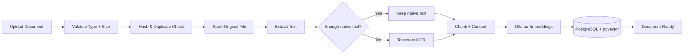
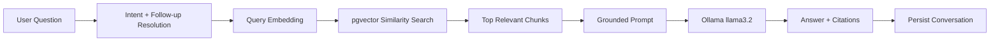
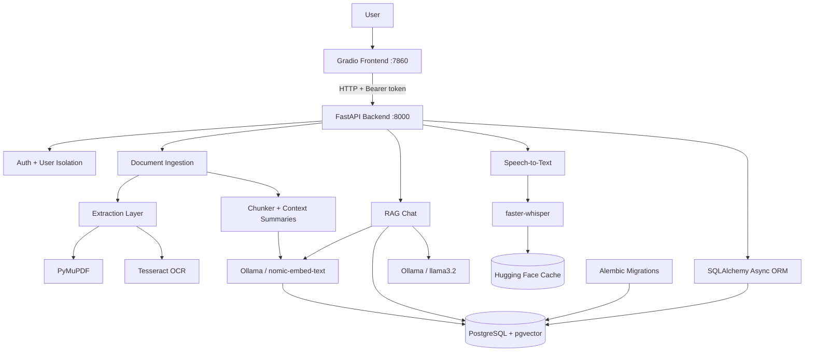

<div align="center">

# 🧠 RAG Document Assistant

<h2>Local-first document intelligence with RAG, OCR, speech-to-text, vector search, and private LLM inference</h2>

<p>
Upload documents, extract even scanned content, index it as semantic vectors, ask grounded questions,
continue multi-turn conversations, speak queries by voice, and receive answers with traceable sources —
all through a Dockerized FastAPI + Gradio application.
</p>

<p>
  
  
  
  
  
  
</p>

<p>
  <a href="#-why-this-project-is-interesting">Why it matters</a> •
  <a href="#-end-to-end-ai-pipeline">AI pipeline</a> •
  <a href="#-technology-stack">Stack</a> •
  <a href="#-getting-started">Run it</a> •
  <a href="#-what-i-learned-building-it">Learning</a>
</p>

</div>

---

# ✨ Why This Project Is Interesting

This project goes well beyond a basic “chat with PDF” demo.

It brings together several AI and software-engineering problems that normally live in separate projects:

<table>
<tr>
<td width="33%" valign="top">

## 📄 Understand Documents

- Native PDF extraction
- Selective **Tesseract OCR**
- DOCX, TXT, Markdown, CSV, HTML and JSON ingestion
- File validation and hashing
- Page-aware metadata
- Persistent document lifecycle

</td>
<td width="33%" valign="top">

## 🔎 Retrieve Meaning

- Context-aware chunking
- Physical chunk overlap
- Rolling context summaries
- **Ollama embeddings**
- `nomic-embed-text`
- **pgvector cosine search**
- **HNSW vector index**

</td>
<td width="33%" valign="top">

## 💬 Answer Naturally

- Local **Ollama LLM**
- `llama3.2`
- Grounded prompts
- Source citations
- Streaming responses
- Conversation memory
- Follow-up resolution
- Voice questions through **faster-whisper**

</td>
</tr>
</table>

The result is a private document workspace where retrieval, AI generation, OCR, audio, authentication, storage, and deployment concerns all meet in one system.

---

# 🤖 End-to-End AI Pipeline

## 1. Document Ingestion



### Extraction is format-aware

The extraction layer supports:

`PDF` · `DOCX` · `TXT` · `Markdown` · `CSV` · `HTML` · `JSON`

For PDFs, the system first tries **PyMuPDF native extraction**. OCR is not blindly applied to every page.

Instead, a page falls back to **Tesseract OCR only when its native text is below the configured threshold**. This keeps text PDFs fast while still supporting scanned and image-only documents.

---

## 2. Context-Aware Chunking

The project deliberately separates two ideas that are often confused:

### Physical overlap

Adjacent chunks share real boundary text so information is less likely to disappear when a sentence crosses a split.

### Rolling context summaries

Later chunks can carry a compact summary of earlier content, giving retrieval and generation more semantic continuity without duplicating the entire document history.

That creates a richer representation than simple fixed-size splitting:

```text
Document
   ↓
Page-aware extraction
   ↓
Chunk 0 ────────────────┐
   ↓ overlap             │
Chunk 1 + prior summary  │
   ↓ overlap             ├─→ semantic embedding
Chunk 2 + prior summary  │
   ↓                     │
... ─────────────────────┘
```

---

## 3. Embeddings + Vector Database

The default local embedding stack is:

```text
nomic-embed-text
        ↓
768-dimensional embedding
        ↓
PostgreSQL + pgvector
        ↓
HNSW cosine-distance index
```

Each searchable chunk stores:

- extracted text
- page number
- chunk index
- chunk hash
- rolling context summary
- vector embedding
- document ownership metadata

### Why PostgreSQL + pgvector?

Using pgvector keeps **relational application data and semantic vectors in the same database**.

That means retrieval can combine vector similarity with normal application constraints such as:

- authenticated user ownership
- document processing status
- selected document IDs
- top-k limits
- relevance score thresholds

The migration layer also adds an **HNSW index** for approximate nearest-neighbour search as the corpus grows.

---

## 4. Retrieval-Augmented Generation



The LLM is **not retrained on uploaded files**.

Instead, RAG retrieves the most relevant chunks at query time and injects them into a grounded prompt. The prompt explicitly tells the model not to invent document facts when the retrieved evidence is insufficient.

That makes the project about **retrieval quality, context construction, grounding, and traceability** rather than pretending uploaded documents magically become part of the model.

---

# 🎙️ Speech-to-Text

Voice input is handled locally with **faster-whisper**.

### The STT pipeline includes

- microphone/audio upload from the Gradio UI
- local Whisper-family transcription
- CPU execution support
- `int8` compute mode
- optional language selection
- configurable beam search
- Voice Activity Detection
- audio validation and size limits
- persistent Hugging Face model caching through Docker volumes

The transcription is inserted into the composer for review before being sent as a RAG question.

This turns the system into a multimodal workflow:

```text
Voice → STT → text query → embedding → retrieval → LLM → cited answer
```

---

# 👁️ OCR for Scanned Documents

OCR is integrated into the ingestion path instead of being a separate tool.

For each PDF page:

1. PyMuPDF attempts native text extraction
2. The extracted character count is checked
3. Weak/image-only pages are rendered
4. Tesseract OCR is attempted
5. The richer result is kept
6. Page metadata records whether text came from native extraction or OCR

The code also includes a Tesseract CLI fallback when the PyMuPDF OCR path does not produce enough readable text.

This is especially useful for:

- scanned lecture notes
- image-only PDFs
- printed forms
- archived documents
- mixed PDFs containing both text and scanned pages

---

# 🧠 Local AI with Ollama

The normal application path is designed to work locally:

| AI task | Default model |
|---|---|
| Embeddings | `nomic-embed-text` |
| Answer generation | `llama3.2` |
| Speech transcription | `faster-whisper` |

Ollama handles both embedding generation and answer generation on the host machine.

Docker containers reach the host Ollama service using:

```text
http://host.docker.internal:11434
```

The project also exposes useful performance controls such as:

- model keep-alive
- startup warmup
- context-window size
- maximum predicted tokens
- request timeout
- retrieved chunk character caps
- context-summary caps
- relevance thresholds

These settings matter a lot when running LLMs locally on CPU-constrained hardware.

> The provider abstraction also supports OpenAI for embeddings and/or generation, but the primary project setup is local Ollama.

---

# 🏗️ System Architecture



### Dockerized services

| Service | Purpose | Port |
|---|---|---:|
| `postgres` | PostgreSQL + pgvector | `5432` |
| `backend` | FastAPI application | `8000` |
| `frontend` | Gradio interface | `7860` |
| Ollama | Runs on the host machine | `11434` |

Docker volumes persist:

- PostgreSQL data
- uploaded documents
- downloaded faster-whisper / Hugging Face model files

---

# 🔐 Authentication & Multi-User Isolation

The application is built as a multi-user workspace rather than a single global document pool.

It includes:

- account registration and login
- PBKDF2-SHA256 password hashing
- random password salts
- signed bearer access tokens
- token expiration
- authenticated document ownership
- authenticated conversation ownership
- user-scoped vector retrieval
- duplicate checks scoped per user

The retrieval query filters by the authenticated user before returning document chunks, which is an important detail in any multi-user RAG system.

---

# 💬 Conversation Intelligence

The chat layer includes more than one-shot Q&A.

### Multi-turn memory

Recent conversation messages are persisted and loaded for follow-up questions.

### Follow-up resolution

The system can rewrite references such as:

> “Explain the third point”

using previous assistant context before retrieval.

### Lightweight intent routing

Simple greetings, thanks, farewells, and calculation-like messages can bypass document retrieval instead of wasting an embedding + vector-search + LLM cycle.

### Streaming

The chat endpoint also supports **Server-Sent Events (SSE)** so answer tokens can be streamed progressively to the frontend.

### Source awareness

Retrieved chunks preserve filename, page, chunk index, score, and excerpts so generated answers can be tied back to the source material.

---

# 🧰 Technology Stack

| Layer | Technology | What it contributes |
|---|---|---|
| Language | **Python 3.12** | Core application and AI pipeline |
| Frontend | **Gradio** | Chat workspace, uploads, document controls, voice input |
| API | **FastAPI** | Typed async REST API and OpenAPI docs |
| ORM | **SQLAlchemy Async** | Async persistence and model mapping |
| Migrations | **Alembic** | Versioned schema evolution |
| Database | **PostgreSQL** | Users, documents, chunks, conversations, messages |
| Vector DB | **pgvector** | Vector storage and cosine similarity search |
| ANN indexing | **HNSW** | Faster approximate vector retrieval at scale |
| Local LLM | **Ollama + llama3.2** | Grounded answer generation |
| Embeddings | **Ollama + nomic-embed-text** | 768-dimensional semantic vectors |
| OCR | **Tesseract + PyMuPDF** | Selective OCR for scanned PDF pages |
| STT | **faster-whisper** | Local voice transcription |
| Extraction | **python-docx, pandas, BeautifulSoup** | DOCX, CSV, HTML and text-oriented formats |
| HTTP | **httpx** | Async service/provider communication |
| Containers | **Docker + Docker Compose** | Reproducible multi-service environment |
| Testing | **pytest / pytest-asyncio** | Unit, integration, security and E2E tests |
| Quality | **Ruff + mypy** | Linting, formatting and type checking |
| CI | **GitHub Actions** | Repository hygiene and secret checks |

---

# 🚀 Getting Started

## 1. Prerequisites

Install:

- **Docker Desktop** with Docker Compose
- **Ollama**
- Git
- enough disk space for Docker volumes and local AI models

The Docker backend image installs Tesseract automatically.

---

## 2. Clone the Repository

```bash
git clone <YOUR_REPOSITORY_URL>
cd RAG-Document-Assistant
```

---

## 3. Create the Environment File

```bash
cp .env.example .env
```

On Windows Command Prompt:

```bat
copy .env.example .env
```

At minimum, replace:

```env
AUTH_SECRET_KEY=replace_with_a_long_random_secret
POSTGRES_PASSWORD=replace_with_a_database_password
```

Generate a strong application secret with:

```bash
openssl rand -hex 32
```

Never commit the real `.env` file.

---

## 4. Pull the Local AI Models

```bash
ollama pull llama3.2
ollama pull nomic-embed-text
```

Make sure Ollama is running:

```bash
ollama list
```

---

## 5. Build and Start the Stack

```bash
docker compose build
docker compose up -d
```

Check status:

```bash
docker compose ps
```

---

## 6. Open the Application

| Service | URL |
|---|---|
| Gradio UI | `http://127.0.0.1:7860` |
| FastAPI docs | `http://127.0.0.1:8000/docs` |
| API health | `http://127.0.0.1:8000/api/v1/health` |
| API readiness | `http://127.0.0.1:8000/api/v1/ready` |

---

## 7. Stop the Stack

```bash
docker compose down
```

> Avoid `docker compose down -v` unless you intentionally want to delete PostgreSQL data, uploaded documents, and cached Whisper models.

---

# 🐳 What Docker Adds to This Project

Docker is not just packaging here; it solves several real integration problems.

### Reproducible services

PostgreSQL/pgvector, FastAPI, and Gradio start with one Compose file.

### Service discovery

The backend reaches PostgreSQL through the Compose service name:

```text
postgres:5432
```

### Host/container networking

Because Ollama runs on the host instead of inside Compose, the backend uses:

```text
host.docker.internal:11434
```

### Persistent state

Named volumes keep:

- vector/database state
- uploaded documents
- Whisper model cache

even when containers are recreated.

### Health-aware startup

The backend waits for PostgreSQL health before starting, and the frontend depends on the backend health check.

Those details made Docker part of the system design rather than an afterthought.

---

# 🧪 Testing, Evaluation & Quality

The project includes automated coverage across multiple levels.

### Test categories

- API behavior
- authentication
- auth boundary/security cases
- chunking and embeddings
- extraction / OCR behavior
- context features
- pgvector retrieval
- end-to-end RAG workflows

Run:

```bash
pytest
```

Lint:

```bash
ruff check .
```

Format check:

```bash
ruff format --check .
```

Type checking:

```bash
mypy backend frontend
```

### RAG evaluation script

`scripts/evaluate_rag.py` runs a small retrieval evaluation dataset and reports whether expected context was retrieved.

That creates an explicit place to evaluate **retrieval quality**, rather than judging the system only by whether the UI returns an answer.

---

# 📁 Repository Structure

```text
RAG-Document-Assistant/
├── backend/
│   ├── app/
│   │   ├── api/endpoints/        # auth, documents, chat, search, audio, health
│   │   ├── core/                 # security, logging, exceptions
│   │   ├── models/               # SQLAlchemy models
│   │   ├── schemas/              # typed API contracts
│   │   └── services/             # RAG, OCR, STT, storage, retrieval, LLM
│   ├── migrations/               # Alembic + pgvector/HNSW migrations
│   ├── tests/                    # automated test suite
│   ├── Dockerfile
│   └── entrypoint.sh
├── frontend/
│   ├── app.py                    # Gradio workspace
│   └── Dockerfile
├── scripts/
│   ├── eval_dataset.json
│   └── evaluate_rag.py
├── docs/
│   ├── ARCHITECTURE.md
│   ├── AI_PIPELINE.md
│   ├── LEARNING_NOTES.md
│   └── TESTING_AND_EVALUATION.md
├── docker-compose.yml
├── .env.example
├── pyproject.toml
├── uv.lock
└── README.md
```

---

# 📚 What I Learned Building It

This project forced me to think about AI systems as **pipelines**, not isolated model calls.

## RAG engineering

I learned how answer quality depends on far more than the LLM:

- extraction quality
- chunk size
- chunk overlap
- context summaries
- embedding quality
- vector similarity
- score thresholds
- top-k selection
- prompt grounding
- conversation context

## OCR

I learned why OCR should be used selectively. Native PDF text is faster and cleaner when available, while scanned pages need a fallback path.

## Vector databases

I worked with embeddings as stored application data, cosine similarity, pgvector operators, relational filters, and HNSW indexing.

## Local AI

Running Ollama locally made model latency, context length, model warmup, CPU constraints, and token limits practical engineering concerns rather than abstract settings.

## Speech-to-text

Adding faster-whisper introduced audio validation, model caching, execution devices, quantized compute, VAD, and latency trade-offs.

## Docker

The project taught me how containers communicate, why persistent volumes matter, how host networking differs from container networking, and how health checks improve multi-service startup.

## Backend architecture

I worked with async FastAPI routes, typed Pydantic schemas, provider abstractions, SQLAlchemy sessions, Alembic migrations, structured logging, and explicit error handling.

## Security

A multi-user RAG application needs more than login screens. Document ownership, conversation ownership, password hashing, signed tokens, upload validation, and user-scoped retrieval all affect whether private data stays private.

## Evaluation

I learned that a RAG system needs retrieval tests and measurable checks — not only “the answer looked good to me.”

---

# 🔍 Deep-Dive Documentation

For implementation details beyond the main README:

- **[System Architecture](docs/ARCHITECTURE.md)**
- **[AI / RAG Pipeline](docs/AI_PIPELINE.md)**
- **[Learning Notes](docs/LEARNING_NOTES.md)**
- **[Testing & Evaluation](docs/TESTING_AND_EVALUATION.md)**
- **[Verification Notes](extra%20documentation/VERIFICATION.md)**

---

# 🌱 Possible Next Steps

The current system already covers a full local RAG workflow. Natural extensions would include:

- retrieval reranking
- hybrid keyword + vector search
- richer evaluation metrics such as MRR / Recall@k
- document-level summarization
- metadata-aware filtering
- GPU-aware transcription/model configuration
- model/provider selection from the UI
- background task queues for large ingestion jobs
- observability dashboards for retrieval and generation latency

---

<div align="center">

## Built to explore how real AI systems fit together

**Documents → OCR → chunks → embeddings → vector search → grounded context → local LLM → cited answers**

</div>
